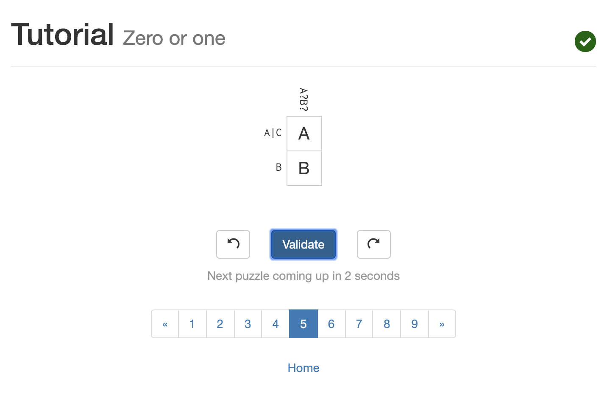

# Lab1.md
## a. Set up Github account and repo for CSCI 4966 labs
Done :white_check_mark:

## b. Create a bio page in the repository
Done :white_check_mark:

## c. Reading assignments
### 1. 10 criteria of open source
Read :white_check_mark:

### 2. Eric Raymond's Smart Questions reading
Suggested additions to section on answering questions:
1. _Provide a brief explanation of why you think the provided solution will work_. A short explanation of why your suggestion will work on the given issue. This might help other users with a similar general issue use parts of your suggestions to solve their problem.
2. _Use alternate terms when applicable_. Sometimes one issue may have different naming conventions, and it may be useful to provide these to avoid duplicate questions (where the only difference is naming of the same thing).

### 3. Chapter 3 of Free Culture by Lawrence Lessig

While the case described in this chapter happened nearly 20 years ago, major industries and individuals are still taking similar copyright cases to court. The RIAA going after Jesse Jordan in 2002 is reminiscent of major labels like UMG going after individual content creators on platforms such as Youtube in 2019. What most strikes me from this piece, apart from the timeliness of it all, is the injustice. The RIAA placed an enormous burden on a student who leveraged a system, but never acted maliciously. I also just can't understand how the legal system allows a major organization to sue a student, and request his entire net worth as a settlement or have him risk going in debt for over 10 times his net worth just to get the change to take the case to course.

## d. Linux
Screenshots of running the tree command on my Ubuntu environment.

_Note:_ There aren't many files here, since I am running Ubuntu through Parallels on a MacOS Mojave system.

## e. Regex
### 1. RegexOne Exercises

### 2. Regex Crossword Exercises
Tutorial

Beginner

## f. Block-based programming

Screenshots from my solution:

## g. Reflection

I recently saw a proposal to join an open source project named AGENCY, which focuses on making customizable software for non-profits. The project has a two "flavors", one to be used by social service agencies, and another to be used for fundraising and volunteer tracking efforts. The project mainly seeks to help non-profit entities have an integrated system to manage their operations, ensuring it will run well on old IT infrastructure, and that it is usable by people without technical backgrounds. I would really like to contribute to this project, or to create other open-source tools that could help community non-profits run more smoothly. At the moment, there is an open [proposal to help create or adapt software for social service agencies through the Albany Public Library community](https://www.cs.rpi.edu/~goldsd/agency-pitch.pdf), so I would love to be a part of that effort through my work in this course.
