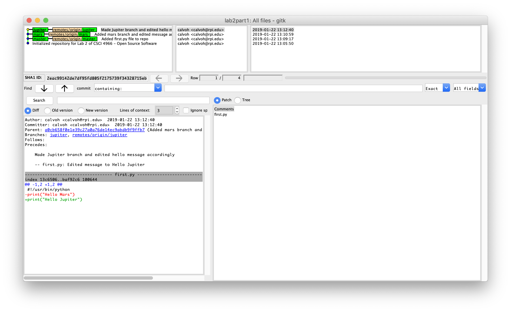
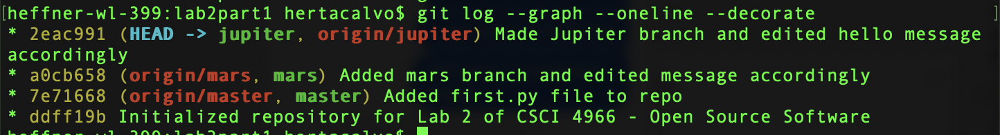
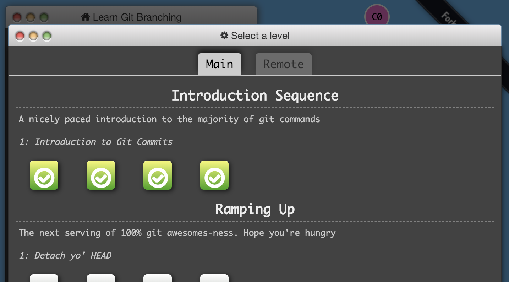

# Lab2.md

## Part 1

** Link to repo **

[https://github.com/hertacalvo/lab2part1](https://github.com/hertacalvo/lab2part1)

** Screenshots **

Screenshot of ``gitk``

Screenshot of ``gitk --all``

Screenshot of ``git log --graph --oneline --decorate``

## Part 2
** Link to fork **

[https://github.com/hertacalvo/Spoon-Knife.git](https://github.com/hertacalvo/Spoon-Knife.git)

** Learn Git Branching **

Screenshot of four completed levels of Learn Git Branching

## Part 3
** Link to my PullReq fork **

[https://github.com/hertacalvo/PullReq](https://github.com/hertacalvo/PullReq)

** Link to my "courseproject" repo **

[https://github.com/hertacalvo/courseproject](https://github.com/hertacalvo/courseproject)

** Link to Table 6 project ideas repo **

[https://github.com/neurosie/ProjectIdeas2019](https://github.com/neurosie/ProjectIdeas2019)
