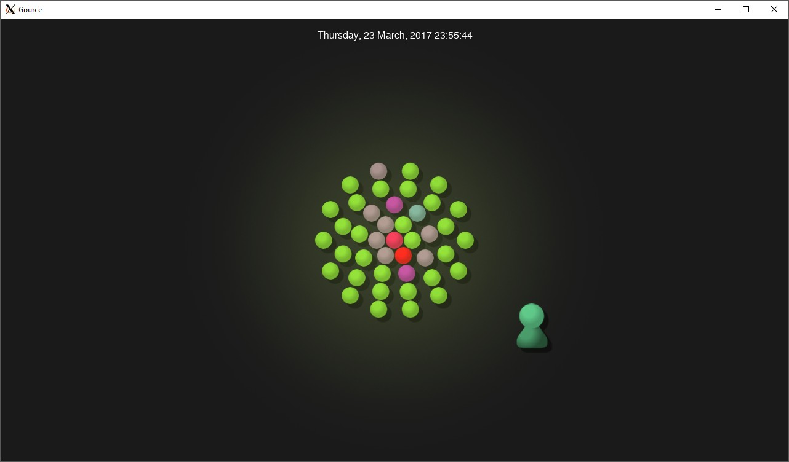

# Lab3.md (actually Lab4)

## Part 0 - Documentation

## Part 1 - Community
### Project stats
**OpenCircuits**
- Number of contributors: 8
- Number of lines of code: 16161 lines
- First commit: Mar/22/2017
- Latest commit: Jan/27/2019
- Current branches: 5

**Organizer**
- Number of contributors: 4
- Number of lines of code: 42759 lines
- First commit: Sep/11/2018
- Latest commit: Jan/18/2019
- Current branches: 2

**PhoneControllers**
- Number of contributors: 3
- Number of lines of code: 74 lines
- First commit: Jan/22/2019
- Latest commit: Jan/25/2019
- Current branches: 1

**Pipeline**
- Number of contributors: 7
- Number of lines of code: 14965 lines
- First commit: Sep/2/2016
- Latest commit: Jan/6/2019
- Current branches: 1

**Red Army App**
- Number of contributors: 1
- Number of lines of code: 23 lines
- First commit: Jan/21/2019
- Latest commit: Jan/25/2019
- Current branches: 1

### Gitstats
**Project: Organizer**  
Changes shown with strikethrough
- Number of contributors: (<s>4</s>) 5
- Number of lines of code: (<s>42759</s>) 20617 lines
- First commit: Sep/11/2018
- Latest commit: Jan/18/2019
- Current branches: 2

### Gource Links
Organizer:
[https://www.youtube.com/watch?v=RNQ1Mi7HG5M&feature=youtu.be](https://www.youtube.com/watch?v=RNQ1Mi7HG5M&feature=youtu.be)

OpenCircuits:

Red Army App:
[https://www.youtube.com/watch?v=nFkt7IjXUms&feature=youtu.be](https://www.youtube.com/watch?v=nFkt7IjXUms&feature=youtu.be)

PhoneControllers:
[https://youtu.be/AL1VwdgS-ck](https://youtu.be/AL1VwdgS-ck)

Pipeline:
[https://www.youtube.com/watch?v=_rcXZxHJkRo&feature=youtu.be](https://www.youtube.com/watch?v=_rcXZxHJkRo&feature=youtu.be)

## Part 2 - Testing
