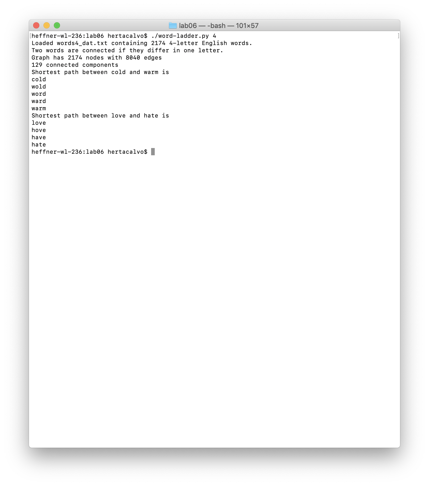
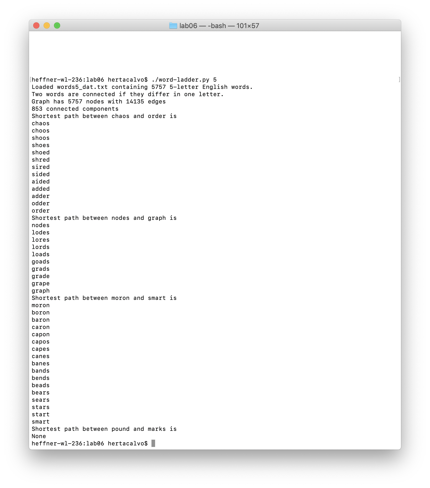
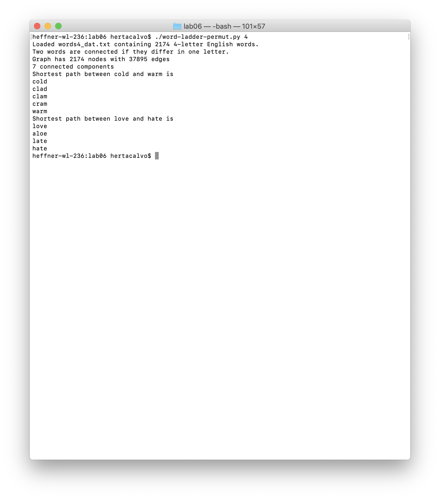
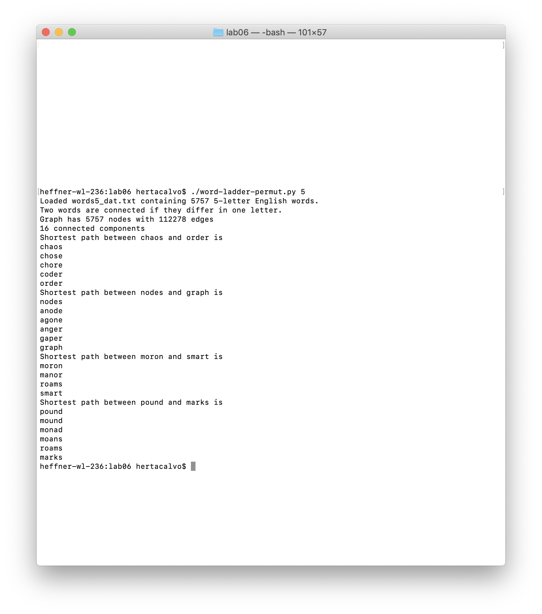
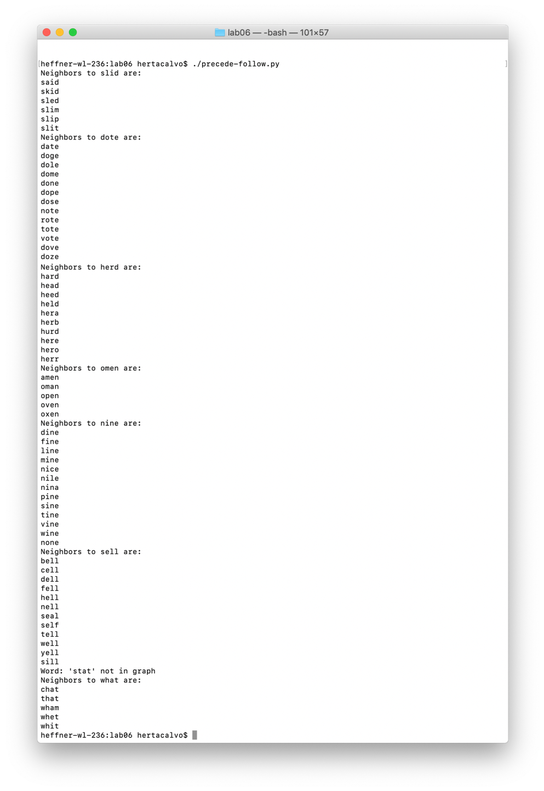

# **Lab6.md**

## **Word ladder**

### Code for the four letter solution
The `word-ladder.py` script has been modified to work with words of length 4 or 5.  
For 4-letter words, the script as follows: `word-ladder.py 4`.  
For 5-letter words, the script as follows: `word-ladder.py 5`.

### Results for the word ladder
**Four-letter words**  
  
**Five-letter words**  
  

## **Unordered word ladder**

### Code for the unordered solution
The `word-ladder-permut.py` script is a reworking of the word ladder program that includes unordered words of length 4 or 5.  
For 4-letter words, the script as follows: `word-ladder-permut.py 4`.  
For 5-letter words, the script as follows: `word-ladder-permut.py 5`.

### Results for the unordered solution
**Four-letter words**  
  
**Five-letter words**  
  

## **Precede-follow**

### Code for precede/follow
The `precede-follow.py` script uses the basics of the word ladder script to find the neighbors of a word (those words that precede or follow it).  

### Results for precede/follow

