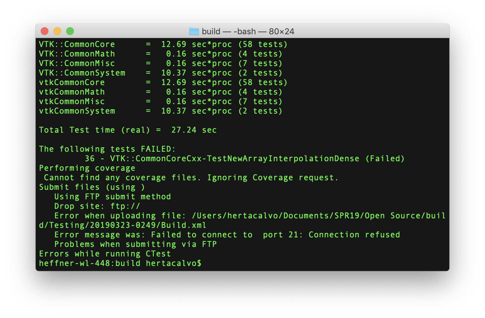

# Lab8.md

## Checkpoint 1: Getting started
**Cmake GUI**  
   
**Successful build**  
   

## Checkpoint 2: Executing the tests
**VTK Dashboard site**  
Find the Nightly and Experimental sections and look at some of the submissions. How can you see what tests where run for a particular submission?    
- Click on the numbers of the "Not Run", "Fail" and "Pass" sections of the build to view which tests these are associated with.

Find a submission with errors. Can you see what the error condition was? How does this help you debug the failure?   

- Click on the number of "Errors" associated with a given build. It will display a webpage that specifies the command, directory and exit conditions of the failures as well as the error messages.
- This helps debug the failure thanks to the information regarding running conditions, and the content of the error messages.

Find a system that is close to your specific configuration in the Nightly section. How clean is the dashboard? Are there any errors that you need to be concerned with?  
- System build: `Mac10.12-clang-dbg-x86_64`.
- Dashboard is pretty clean: no errors on "Configure", 5 warnings and no errors on "Build", and only 1 fail on "Test".

**Experimental build (failed)**  
   

## Checkpoint 3: Adding a Test
**Added test**  
   

**Added test to cmakelists**  
   

**Experimental build (still failed)**  
   

## Checkpoint 4: Fixing the text
**Test fixes**  
   
   

**Running fixed tests**  
   
