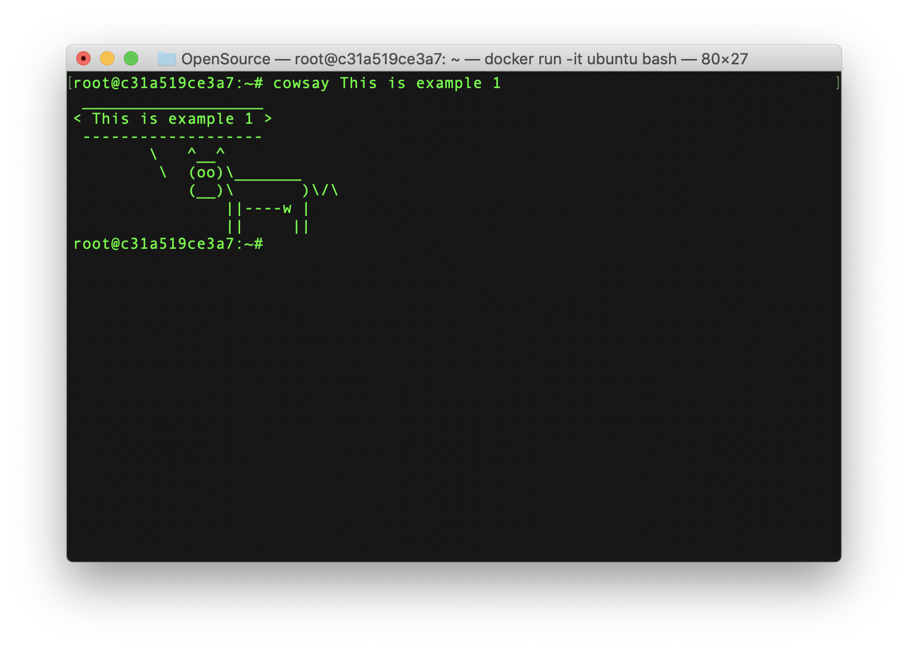
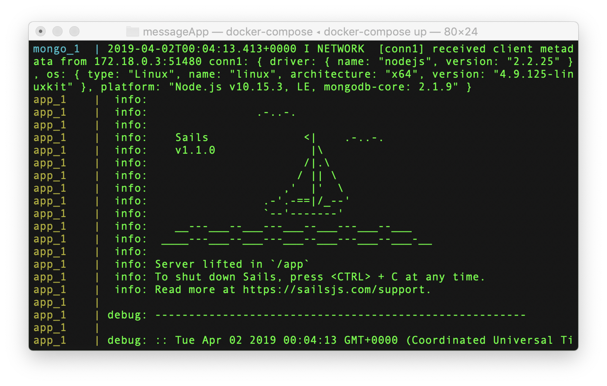

# Lab9.md - Virtualization

**Example 0**  
The wifi wasn't working in the classroom, so a classmate airdropped Docker to everyone with a Mac  
  
Successful installation:  
    

**Example 1**  
Making a file using Vim in an Ubuntu container:  
    
Using cowsay in an Ubuntu container:  
   

**Example 2**  
RocketChat running:  

**Example 3**  
Couldn't get flask to work:  

**Example 4**  
It worked!  
  
Curl commands: 
  
