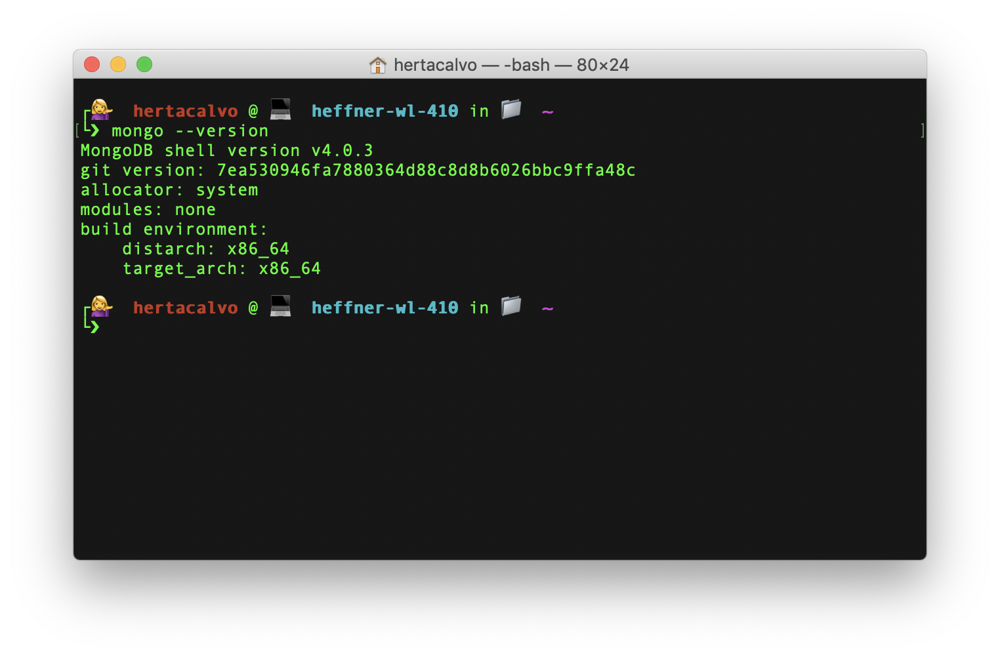
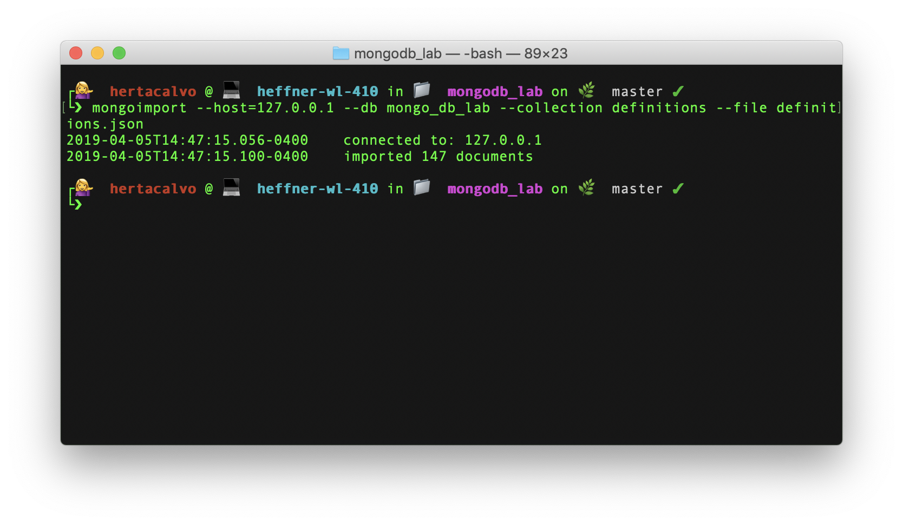
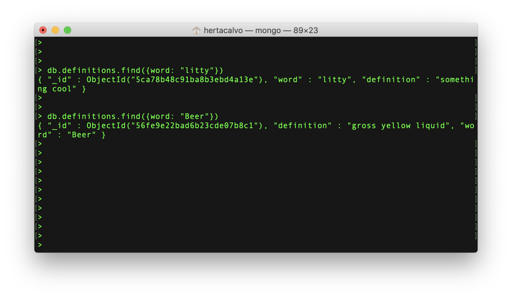
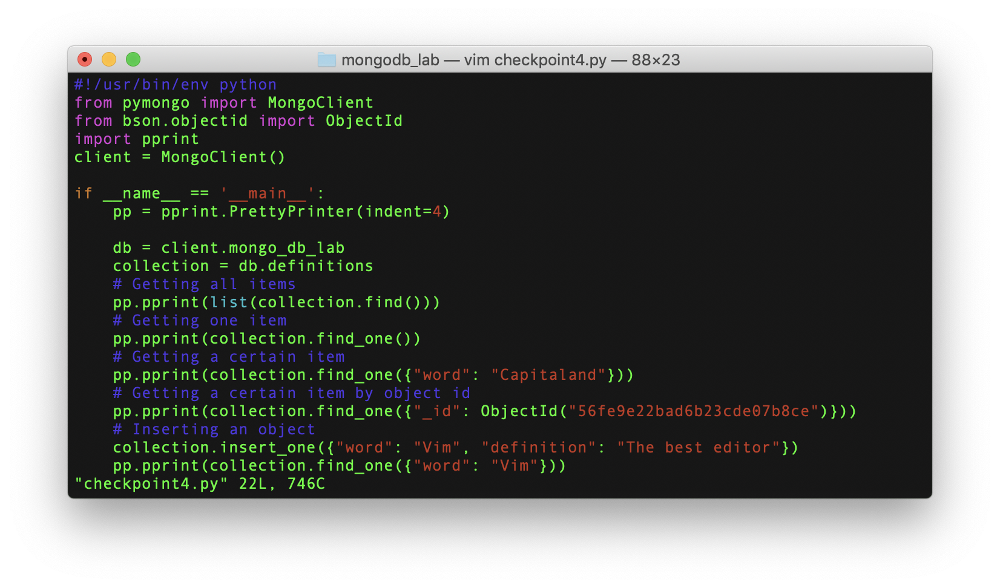
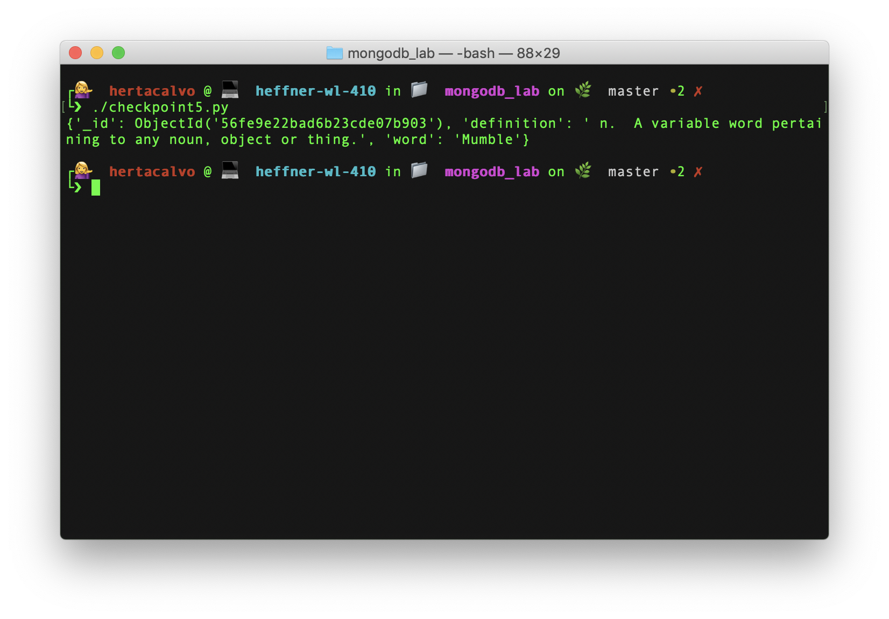
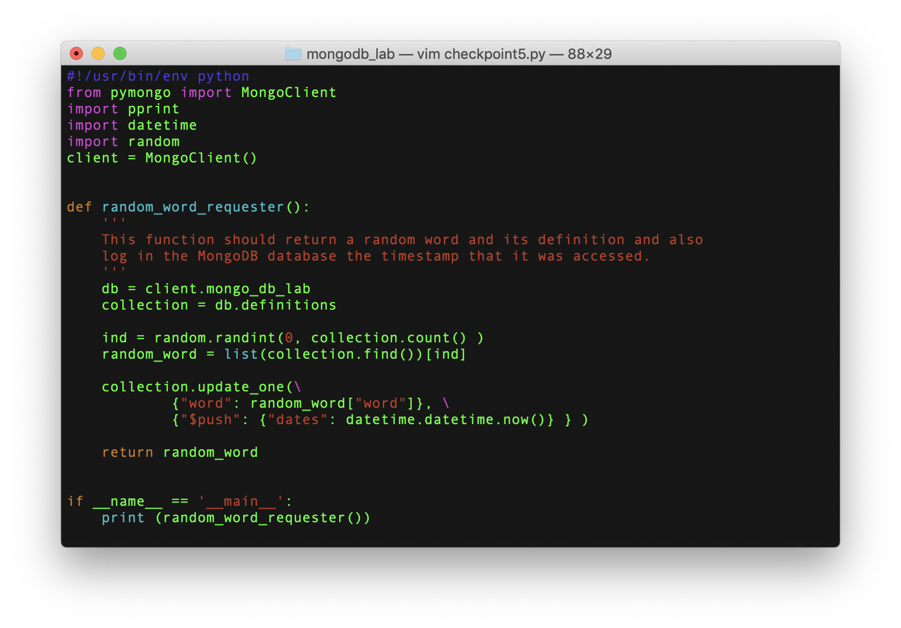
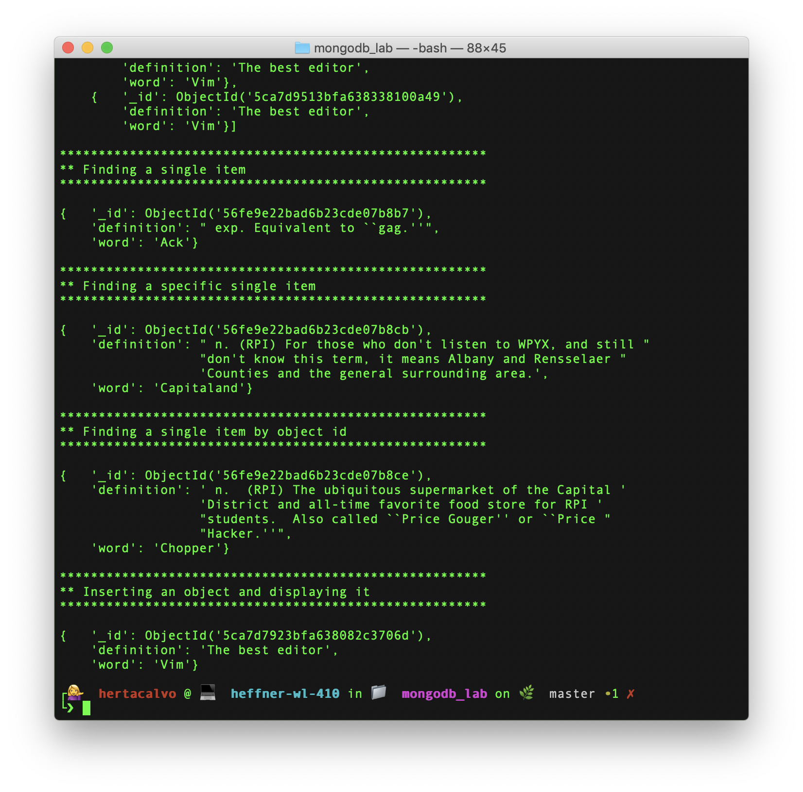

# Lab10.md

## 1. Install MongoDB
Done ✅  
   

## 2. Load some data
Data loaded with command `mongoimport --host=127.0.0.1 --db mongo_db_lab --collection definitions --file definitions.json`  

Here's the screenshot:  
  

## 3. Basic Queries
The `git diff` command did not work (not surprised), but here's a screenshot of the addition and update to the database:  
  

## 4. Driving Queries
Code for `checkpoint4.py`:  
  
Output after running `checkpoint4.py`:  
  

## 5. Random Word Requester
Code for `checkpoint5.py`:  
  
Output after running `checkpoint5.py`:  
  
